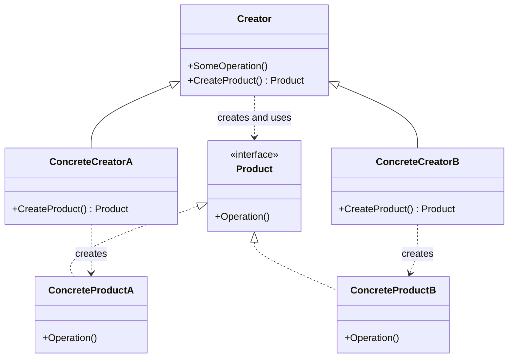

# 工厂方法（Factory Method）

## 学习信息

| 项目 | 内容 |
| --- | --- |
| 分类 | 创建型模式（Creational Pattern） |
| 别名 | 虚拟构造函数（Virtual Constructor） |
| 学习状态 | 🟡 学习中 |
| 当前阶段 | 概念理解 |
| 计划实现语言 | C# |
| 首次学习日期 | 2026-08-11 |
| 最近复习日期 | — |

## 第一阶段：概念理解

### 一句话理解

工厂方法把“创建哪一种具体产品”的决定交给创建者的子类，使依赖产品抽象的业务流程不必了解具体产品类。

### 意图

当一段业务逻辑需要使用某类产品，却不应该绑定某个具体产品时，在创建者中声明返回产品抽象的工厂方法，
再由具体创建者决定返回哪一种具体产品。

它希望达到的目标是：

- 业务逻辑依赖稳定的产品抽象，而不是具体产品类。
- 产品创建逻辑拥有明确的扩展点。
- 增加新产品时，尽量通过新增具体产品和具体创建者完成，而不是反复修改已有客户端逻辑。

### 问题场景

假设一个消息发送流程最初只支持电子邮件。发送前后的校验、记录和重试逻辑都直接创建并使用
`EmailMessage`。后来系统需要支持短信和应用内消息，如果每增加一种渠道都在业务流程中加入新的条件分支，
创建逻辑会逐渐散落，业务代码也会持续依赖更多具体类型。

真正的问题不是调用一次构造函数，而是“稳定的发送流程”和“不断变化的消息类型”耦合在了一起。工厂方法
让基础发送流程只使用 `Message` 抽象，把具体消息的创建延迟到 `EmailSender`、`SmsSender` 等具体创建者。

如果产品类型固定、创建过程简单且没有扩展需求，直接调用构造函数通常更加清晰，没有必要引入该模式。

### 核心思路

1. 为所有产品提取一个能满足客户端需求的公共接口。
2. 在创建者中声明返回该产品接口的工厂方法。
3. 创建者的核心业务逻辑只通过产品接口工作，并通过工厂方法获取产品。
4. 具体创建者重写工厂方法，返回与自身场景匹配的具体产品。

这里的“工厂”通常只是创建者职责的一部分。创建者往往还包含使用产品的核心业务流程；工厂方法提供的是
流程中的可变创建步骤。工厂方法也不必每次都生成新对象，它可以返回缓存对象、对象池中的对象或其他已有实例。

### 结构

### 参与者与职责

| 参与者 | 职责 |
| --- | --- |
| 产品（Product） | 声明所有具体产品都必须提供的公共操作。 |
| 具体产品（Concrete Product） | 实现产品接口，提供不同的具体行为。 |
| 创建者（Creator） | 声明工厂方法，并在核心业务逻辑中通过产品抽象使用其返回结果。 |
| 具体创建者（Concrete Creator） | 重写工厂方法，决定返回哪一种具体产品。 |
| 客户端（Client） | 选择合适的创建者，并通过创建者提供的抽象流程工作。 |

创建者可以把工厂方法声明为抽象方法，也可以提供一个默认产品。所有具体产品必须满足同一个产品抽象，
否则创建者中的通用业务逻辑无法一致地使用它们。

### 适用条件

适合考虑工厂方法：

- 创建者无法提前确定最终需要创建的具体产品类型。
- 产品创建需要成为库或框架留给使用者的扩展点。
- 创建者拥有稳定业务流程，但流程中使用的具体产品需要变化。
- 创建过程需要集中管理缓存、复用或对象池等策略。

不适合使用：

- 只有一种产品，而且没有可见的扩展需求。
- 创建逻辑只是简单构造，直接依赖具体类型反而更容易理解。
- 只需要根据一个参数集中选择产品，简单工厂函数已经足够。
- 为每个产品增加一组子类带来的复杂度超过解耦收益。

### 优点与代价

#### 优点

- 减少创建者业务逻辑对具体产品的依赖。
- 将产品创建集中在明确的扩展点中。
- 新增具体产品时，可以通过扩展而不是修改核心业务流程完成。
- 创建策略可以独立处理复用、缓存或延迟创建。

#### 代价与风险

- 通常需要同时增加具体产品和具体创建者，类的数量会上升。
- 它主要通过继承改变创建行为，可能让原本简单的构造过程变得间接。
- 如果创建者本身没有值得复用的业务流程，完整类层次可能显得多余。
- 名称中包含“工厂”的方法不一定就是 GoF 工厂方法；关键在于子类能否通过重写创建步骤改变产品类型。

### 与相近方案的区别

| 方案或模式 | 主要区别 |
| --- | --- |
| 直接构造 | 客户端明确依赖具体类型；简单直接，但创建类型发生变化时需要修改客户端。 |
| 简单工厂 | 通常由一个函数根据参数选择具体产品，不依赖创建者子类的多态重写。它常用但不属于 GoF 23 个模式。 |
| 抽象工厂 | 面向一组相互匹配的产品；工厂方法通常面向一个产品层次，抽象工厂内部也可以由多个工厂方法组成。 |
| 生成器 | 关注复杂对象如何分步骤构建，同一构建过程可以产生不同表示。 |
| 原型 | 通过复制现有对象创建产品，避免依赖创建者继承层次，但需要正确处理复制和初始化。 |
| 模板方法 | 固定算法骨架并开放部分步骤；工厂方法可以成为模板方法中的一个可重写创建步骤。 |

### 常见误解

- **误解：只要把 `new` 放进一个方法就是工厂方法。** 这更可能只是封装构造或简单工厂；GoF 工厂方法的
  关键是创建者子类通过多态决定产品类型。
- **误解：创建者只负责创建对象。** 创建者通常还包含依赖产品抽象的业务逻辑，创建只是其中的可变步骤。
- **误解：调用工厂方法一定得到新对象。** 返回缓存、池化或已存在对象同样符合其意图。
- **误解：用了工厂方法就完全消除了具体类型。** 具体类型仍然存在，只是被限制在具体创建者和系统装配位置。

### 设计原则

- **依赖倒置**：高层业务逻辑依赖产品抽象，而不是具体产品。
- **开闭原则**：通过增加具体创建者和产品扩展行为，减少对已有流程的修改。
- **单一职责**：将具体产品的创建决策从使用产品的通用业务流程中分离。
- **封装变化**：把可能变化的产品类型封装在工厂方法这个扩展点后面。

## 第二阶段：代码实现

待后续使用 C# 完成基础示例与自动化测试。实现时重点验证：

- 创建者的核心逻辑只依赖产品接口。
- 不同具体创建者返回不同产品，并能复用同一套核心逻辑。
- 增加新的具体产品和创建者不需要修改已有客户端流程。

## 第三阶段：体验总结

待完成代码和测试后补充，重点记录：

- 与直接构造和简单工厂相比，工厂方法增加的结构是否值得。
- 继承式扩展在 C# 中的可读性、测试体验和限制。
- 实际项目中依赖注入容器、委托或泛型能否提供更简单的替代方案。

## 参考资料

- [Refactoring.Guru：工厂方法模式](https://refactoringguru.cn/design-patterns/factory-method)
- [Refactoring.Guru：C# 工厂方法示例](https://refactoringguru.cn/design-patterns/factory-method/csharp/example)
- 《设计模式：可复用面向对象软件的基础》：Factory Method 章节

本文为学习归纳，概念说明和示例场景使用自己的语言重新组织；完整图解、伪代码及实现步骤请查看原始资料。
